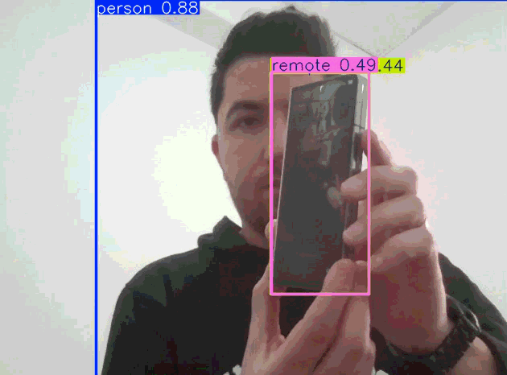

# Real-Time Object Detection with YOLOv8

Real-Time Object Detection Pipeline (YOLOv8)
An efficient computer vision implementation for real-time object detection and spatial tracking. This project leverages the YOLOv8 architecture to perform high-speed inference on live video streams.

# Features
Synchronous Inference: Optimized for low-latency detection using the ultralytics engine.

Multi-Class Support: Capable of identifying 80+ distinct object categories.

Modular Integration: Designed for easy deployment in Python-based environments.

## Installation & Usage

1. **Install dependencies:**
   ```bash
   pip install ultralytics opencv-python
   
2. **Run the application:**
   ```bash
   python detect.py
   
##   Technologies Used:
Python

OpenCV (for camera access)


PyTorch (for AI processing)
